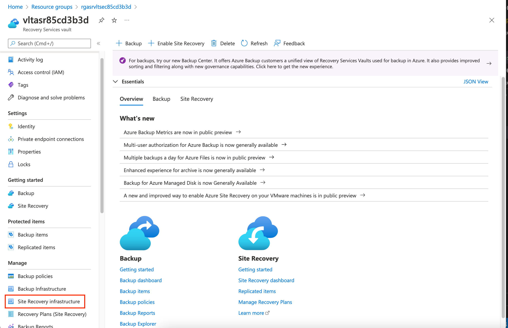
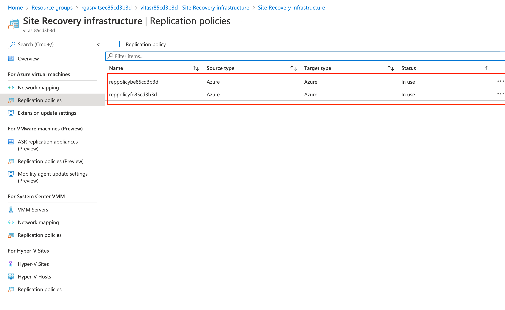
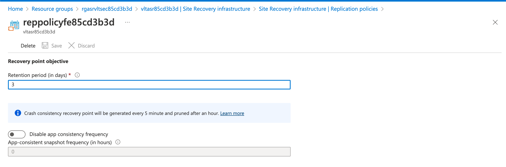
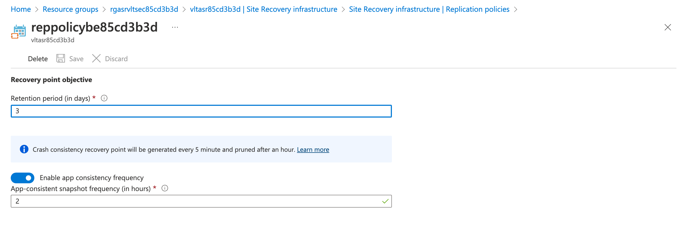
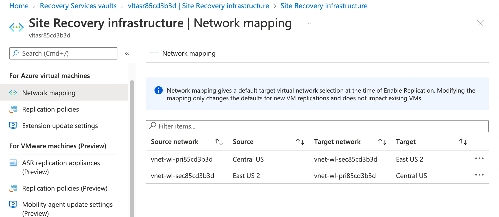
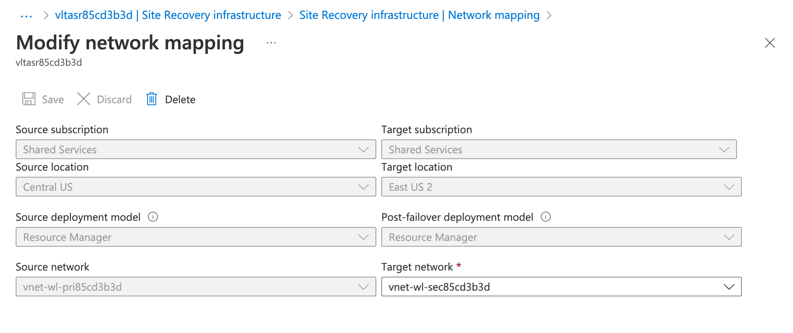

## Exercise 2 - Replication Policies and Network Mappings

In this exercise you will open the Azure Portal and Recovery Services Vault. You will learn about [replication policies](https://docs.microsoft.com/en-us/azure/site-recovery/azure-to-azure-architecture#replication-policy) and [network mappings](https://docs.microsoft.com/en-us/azure/site-recovery/azure-to-azure-network-mapping).

Open the Azure Portal and select the resource group that begins with rgasrvltsec. Select the vault that begins with the name vltasr. Select the Site Recovery infrastructure link as seen in the image below.

On this page you will notice the different types of replication settings are grouped into different categories based upon the source machine you are replicating.

Select replication policies under the for Azure virtual machines section. The lab comes with two replication policies. The policy that begins with reppolicybe is the policy used for replication of the backend VM while the policy that begins with reppolicyfe is used for replication of the frontend VM.

Open the replication policy that begins with reppolicyfe.

Replication policies define the retention of the snapshots taken of the VM and the [consistency](https://social.msdn.microsoft.com/Forums/azure/en-US/148a9472-e69d-4516-994c-d4f7287c76bb/crashconsistent-and-appconsistent-whats-the-difference?forum=hypervrecovmgr). Crash-consistent snapshots are taken every 5 minutes and this cannot be modified. Application-consistent snapshots can optionally be enabled in addition to crash-consistent snapshots at a minimum of 1 per hour. Snapshots are [pruned automatically](https://docs.microsoft.com/en-us/azure/site-recovery/site-recovery-faq#how-are-recovery-points-generated-and-saved-) by Azure Site Recovery.

Since the policy is used by the stateless frontend VM, only crash-consistent snapshots are taken.

Open the replication policy that begins with reppolicybe.

This policy is configured for application-consistent snapshot because it used by the stateful backend VM. There may be transaction logs or items in memory that should be written to disk before the snapshot is taken.

Navigate back to the Site Recovery infrastructure page. Select the Network mapping link under the for Azure virtual machines section.

Network mappings are used by Azure Site Recovery to map the destination virtual network a machine should be failover over to. This lab has two network mappings configured. One network mapping maps the virtual network in the primary region to the virtual network in the destination region for failover. The other mapping maps the virtual network in the secondary region to the virtual netwokr in the primary region for failback.

Select the first network mapping in the list.

Take note that the virtual networks included in the mapping can be in different subscriptions. In addition to disaster recovery scenarios, Azure Site Recovery services can also be used to migrate VMs between subscriptions within the same Azure AD tenant. This may be a requirement if you're redoing your subscription model and moving to a [more democratized model](https://github.com/geeksintheweeds/cloud-journey/tree/main/2.%20Azure%20Foundations).

This completes exercise 2. You can now proceed to [exercise 3](/exercises/exercise3.md).
