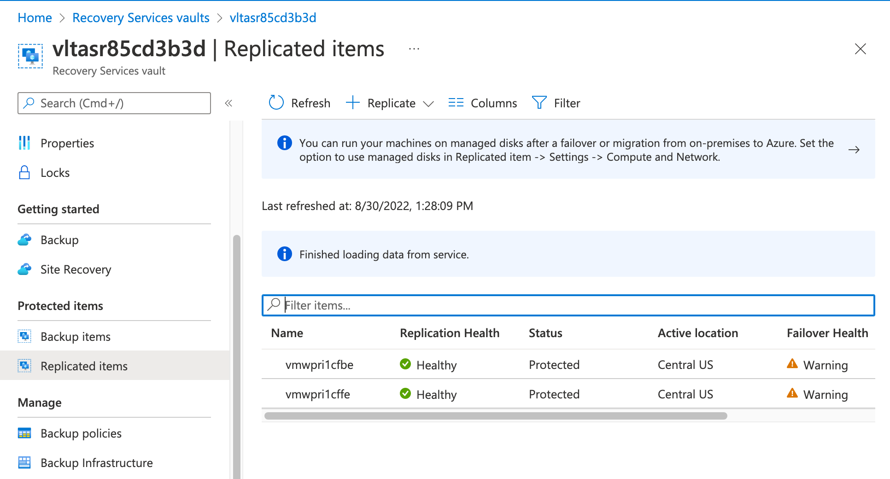
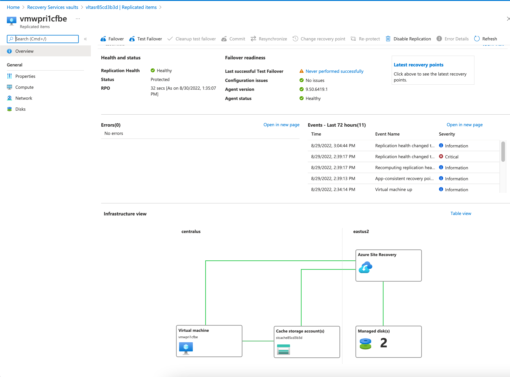
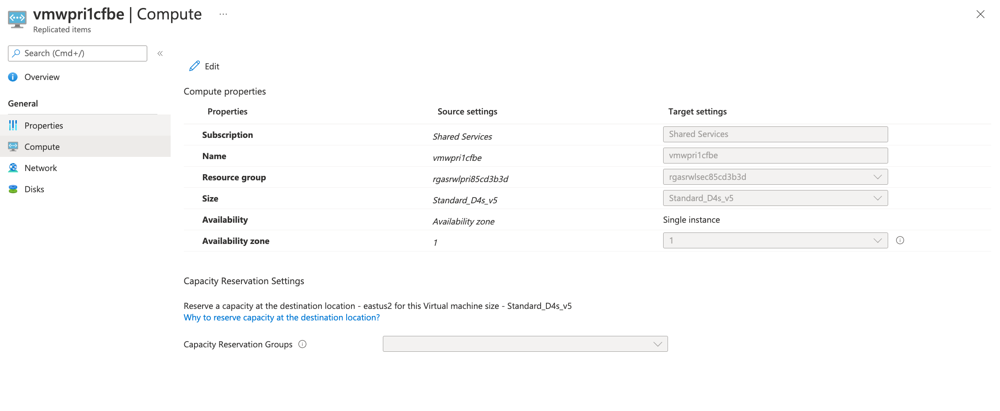
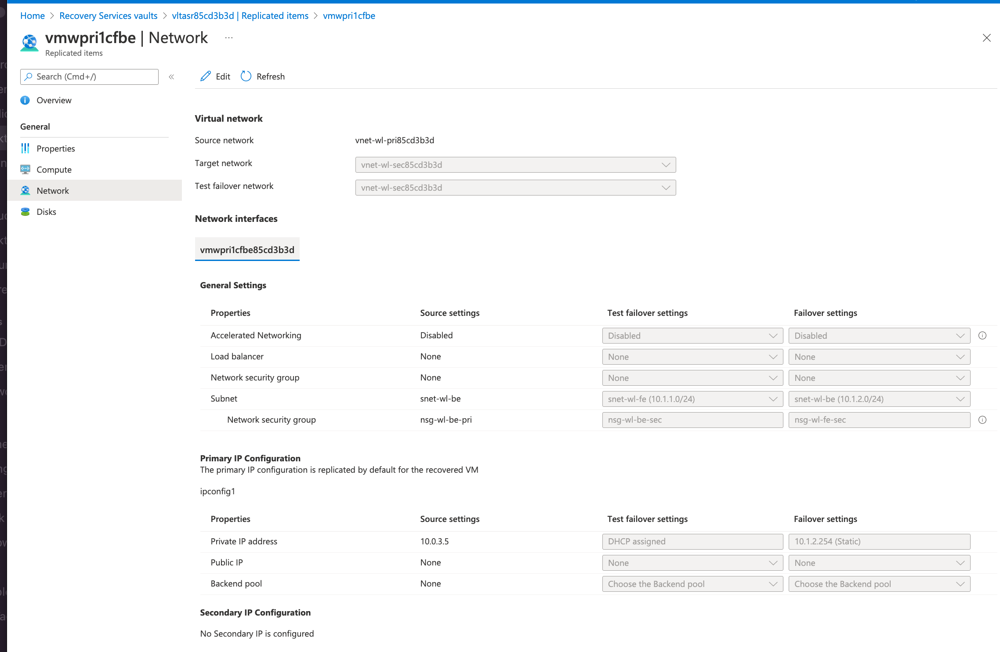
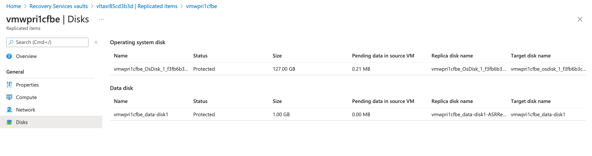

## Exercise 3 - Replicated Items

In this exercise you will review replicated items. A replicated item represents a machine that has been configured for replication with Azure Site Recovery within a given Recovery Services Vault.

Two VMs in this lab (vmwpricfbe and vmpricffe) have been configured for replication. In the next steps you will review the configuration information the vault stores about the VMs.

Open the Azure Portal and select the resource group that begins with rgasrvltsec. Select the vault that begins with the name vltasr. Select the replicated items link.

On this page you will see the replicated items representing the two VMs that have been configured for replication. It provides you with an overview of the state of the machine such as its present location and health of the replication.

Select the vmwpri1cfbe from the replicated items page.

This page provides you with a holistic view of the data Azure Site Recovery holds about the VMs failover configuration. You can initiate a failover, run a test failover and modify the failover configuration.

Select the Compute link from the General section.

On this page you can modify the properties of the VM when it fails over. This includes modification of the SKU or adding a [capacity reservation](https://docs.microsoft.com/en-us/azure/virtual-machines/capacity-reservation-overview). It is highly recommend to ensure you have a capacity reservation in place for mission critical infrastructure. While the Azure Site Recovery team makes a best effort to ensure resources are available, a capacity reservation provides an SLA guaranteeing the capacity is there when you need it.

Select the Network link from the General section.

On this page you can modify networking properties of the VM. This includes the subnet the failed over VM is deployed to or setting a static IP address.

Select the Disks link from the General section.

This page shows the listing of disks being replicated and the name of the replicated disk in the second region. You are also provided some basic metrics around the data that is pending to be written to the disk in the second region.

This completes exercise 3. You can now proceed to [exercise 4](/exercises/exercise4.md).
