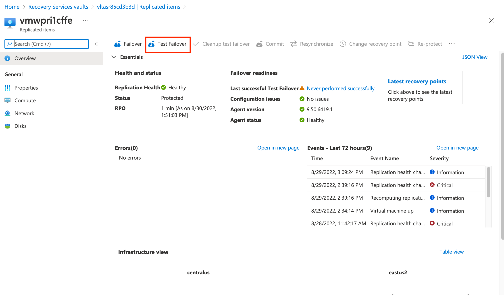
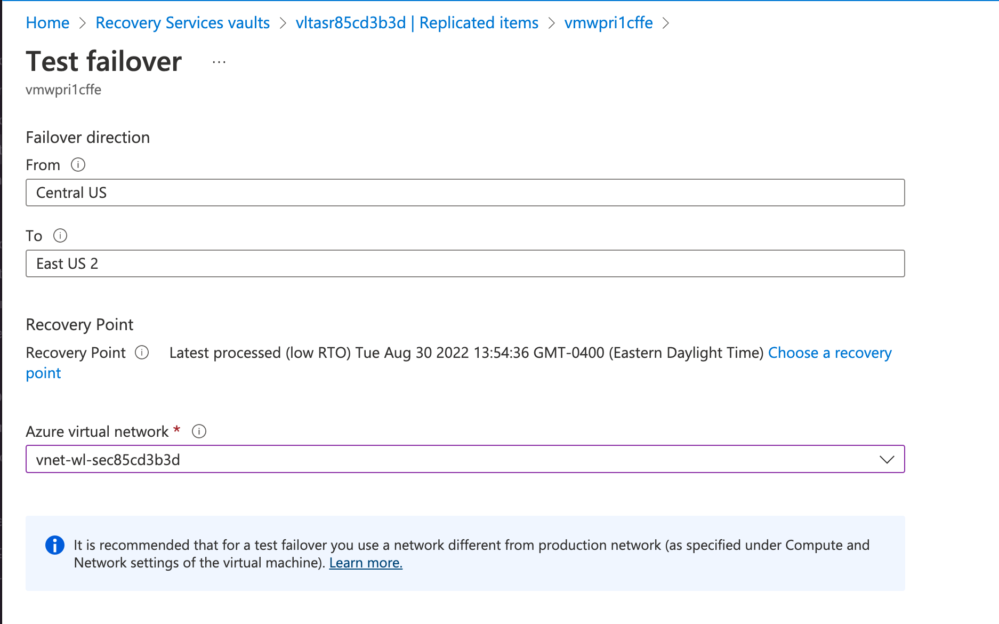
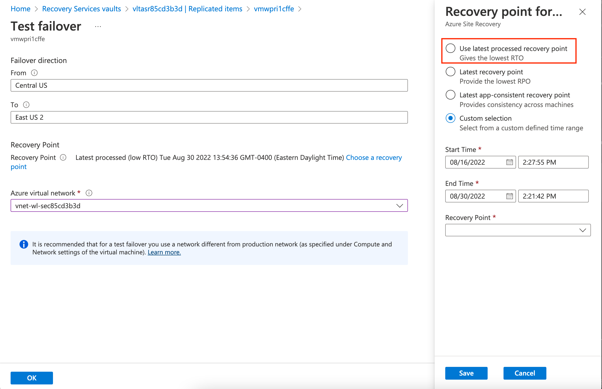
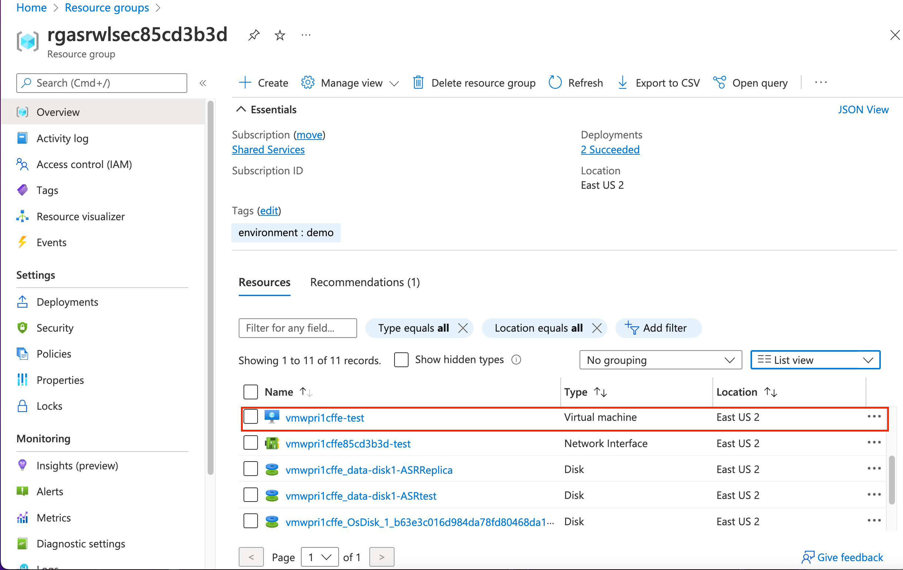
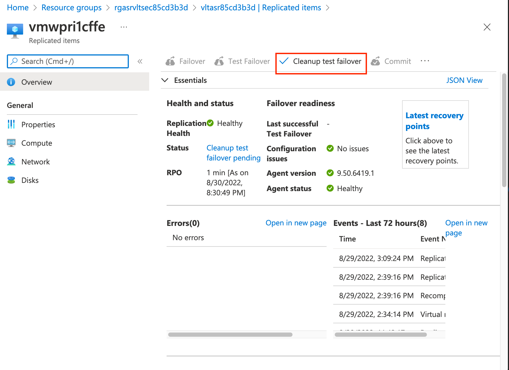

## Exercise 4 - Failovers

In this exercise you will perform a [test failover](https://docs.microsoft.com/en-us/azure/site-recovery/site-recovery-test-failover-to-azure) of the VM vmwpri1cffe. Test failovers allow you to test your disaster recovery process to validate it works the way you expect it to work. Running a test failover does not affect ongoing replication and can be easily cleaned up once you're complete.

Open the Azure Portal and select the resource group that begins with rgasrvltsec. Select the vault that begins with the name vltasr. Select the replicated items link and select vmwpri1cffe. Select the Test Failover link.

The test failover page shows you the region the VM is currently in and where it is set to failover to. You can optionally select a specific recovery point and select a virtual network to failover to. Note that the virtual networks listed are virtual networks that you defined in network mappings. In a production environment it is recommended you have a non-production virtual network that you test failovers with.

Select the choose a recovery point link.

Azure Site Recovery provides you with options for the recovery points you want to recover a VM to. You can choose the lowest RTO, lowest RPO, latest app-consistent (assuming one is configured in the replication policy) or you can choose a custom recovery point from a specific date.

Choose option for the recovery point with the lowest RTO and hit the save button and then click the OK button to begin the test failover.

The test failover will begin.

Once Azure Site Recovery completes the test failover, navigate to the resource group that begins with rgasrwlsec.

Azure Site Recovery creates a new VM in the secondary region which utilized the recovery point captured by the service. At this point you would do any necesary testing on the VM that you needed to do to validate the health of the recovery.

Open the Azure Portal and select the resource group that begins with rgasrvltsec. Select the vault that begins with the name vltasr. Select the replicated items link and select vmwpri1cffe.

Once your testing is complete you can clean up the VM by selecting the cleanup test failover link. 

This completes exercise 4. You can now proceed to [exercise 5](/exercises/exercise5.md).
