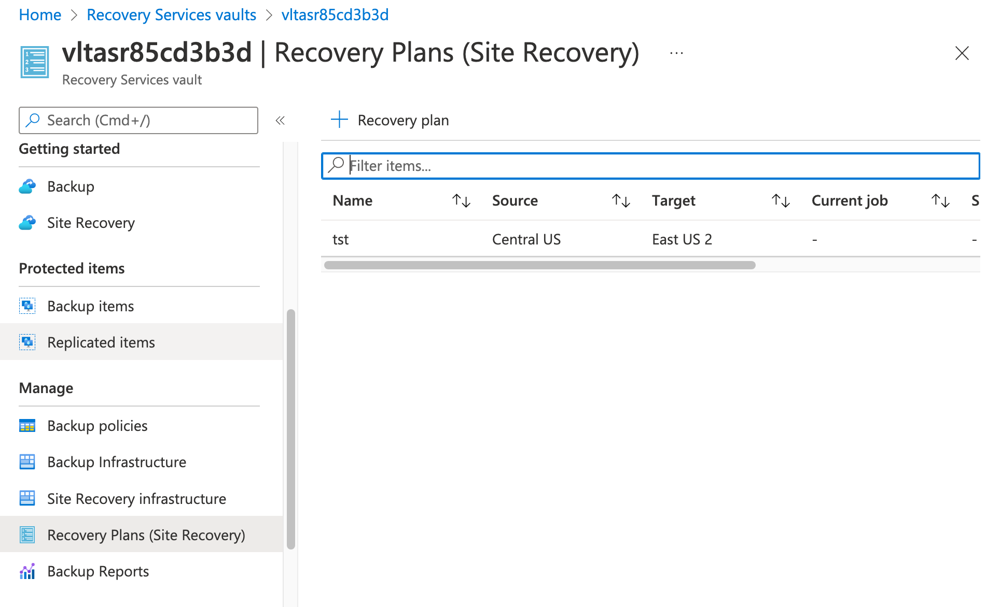
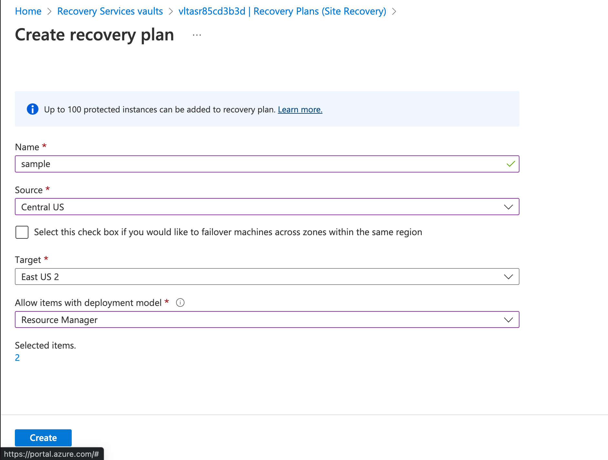
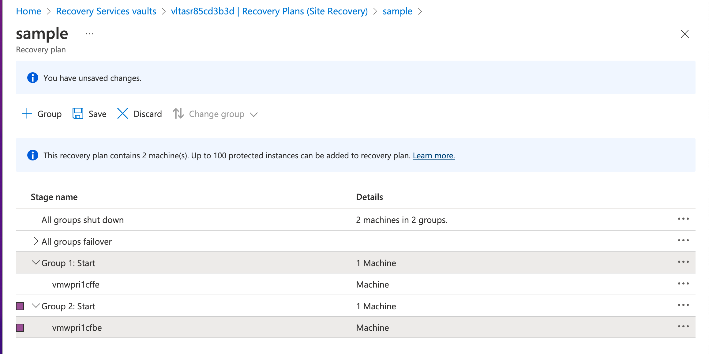
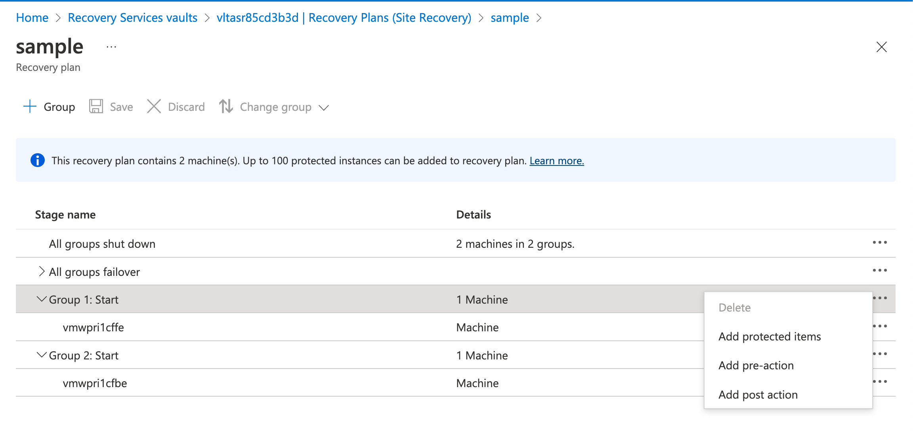
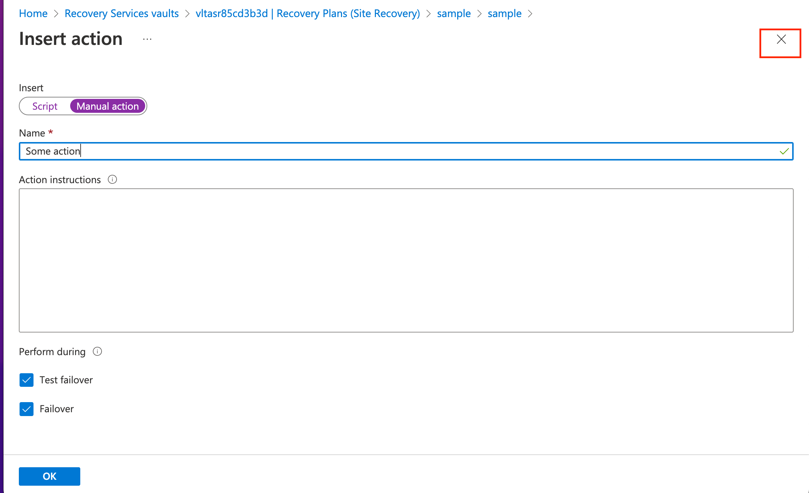
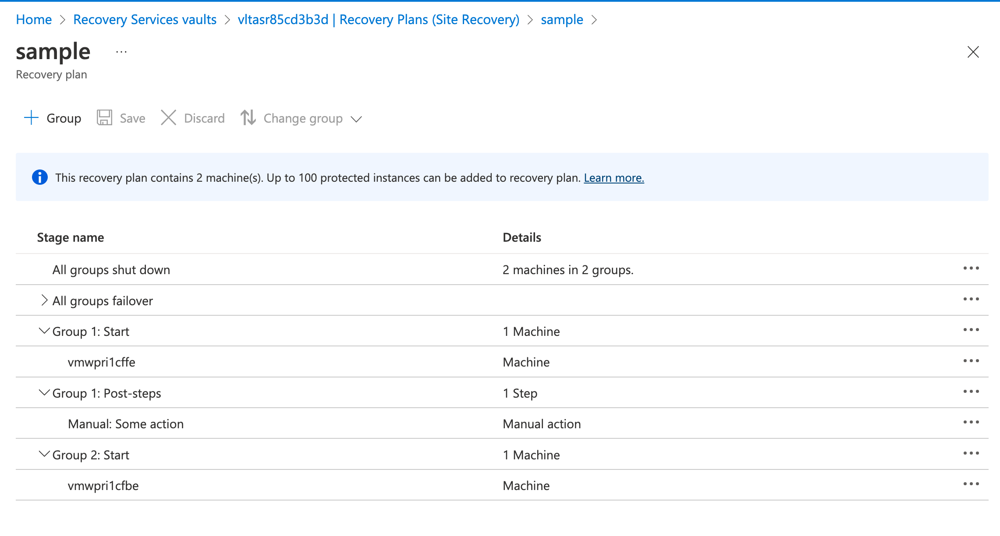
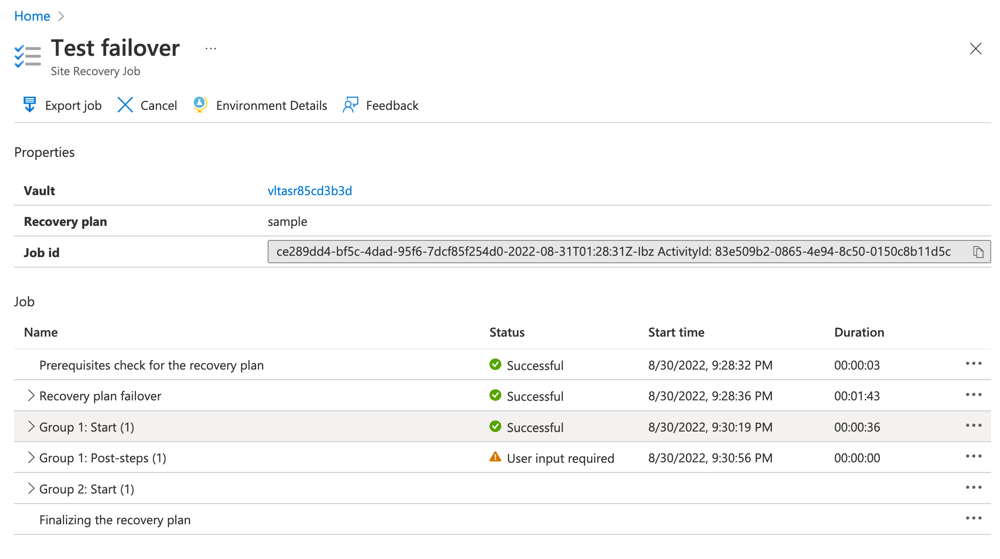
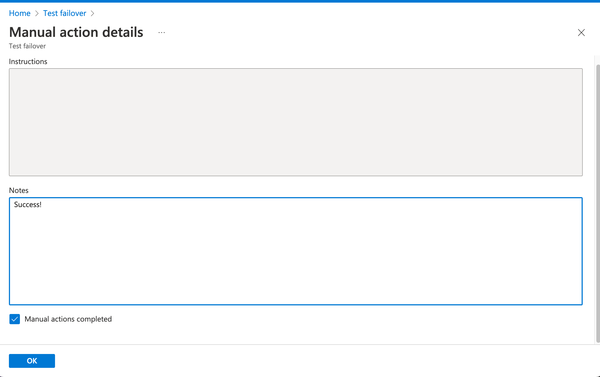
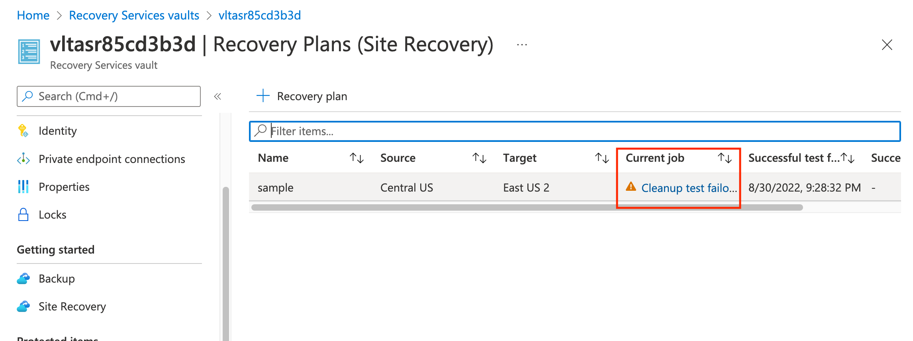

## Exercise 5 - Recovery Plans

In this exercise you will create a [recovery plan](https://docs.microsoft.com/en-us/azure/site-recovery/recovery-plan-overview). Recovery plans allow you to define a multi-step recovery process which can include multiple machines, manual processes, and automated processes using [Azure Automation](https://docs.microsoft.com/en-us/azure/automation/overview). You might use a recovery process to orchestrate the restoration of a multi-tier application.

Open the Azure Portal and select the resource group that begins with rgasrvltsec. Select the Recovery Plans link from the Manage section.

Recovery plans that have been created within the vault are shown here. Take note that you can run test failovers the same way you can run them for single machines.

Select the + Recovery plan link.

Here you can define the basic properties of the Recovery Plan. Plans can be created for both failover and failback by modifying the source and destination regions. 

Notice the option for failover of machines across zones in the same region. In addition to replication between regions, Azure Site Recovery can replicate [between availability zones](https://docs.microsoft.com/en-us/azure/site-recovery/azure-to-azure-how-to-enable-zone-to-zone-disaster-recovery) or even moving a VM not within an availability zone into an availability zone.

For this lab you create a recovery plan that includes both the frontend and backend VMs. Configure the plan with the settings in the screenshot below. Ensure you set the source region to the same value you set the primary region and the target region to the secondary region. Select the VMs vmwpri1cffe and vmwpri1cfbe.

Open the Azure Portal and select the resource group that begins with rgasrvltsec. Select the Recovery Plans link from the Manage section. Select the Recovery Plan you created.

This page provides you an overview of recovery plan. Here you can run a failover or test failover using the recover plan.

Select the customize link in the the Recovery Plan overview page. This page allows you to group the VMs included in the recovery plan to perform specific operations on that set of VMs. 

Select the + Group link to create a second group. Expand Group 1 and click on vmpri1cfbe. Click the Change Group link to move that VM to the newly created Group 2.

Your recovery plan should look like the screenshot below.

Select the ellipses to the right of the Group 1 row. Here you can add machines that are not already in the group to the group. You can also add automated processes using Azure Automation such as modifying DNS. Manual processes are supported as well that require a user to move the process forward. The manual process could be updating some a 3rd party firewall or performing some type of testing.

Select the Add post action link. You are prompted as to whether you want to create an automated or manual action. Select a manual action and fill in whatever name and action you want. Ensure both the test failover and failover boxes are checked and click OK. You'll notice the screen doesn't change due to a bug with the GUI. Click the gray X in the top right-hand corner of the screen as shown in the screenshot below. Ignore the browser prompt that your changes will be lost. When you get back to the steps of the recovery plan click the save button to commit the new post action.

At this point your recovery plan should look like the screenshot below.

Navigate back to the list of recovery plans and select the recovery plan you created. Click on the test failover link to initiate a test failure. You can leave the recovery point to the default but you must select the target virtual network. Once complete, click OK and the test failover will begin.

Once the frontend VM is failed over, the service will notify that you that it is waiting on a user action to move on to the backend VM as seen in the image below.

Select the ellipses next to the manual action and select complete manual action. You're able to provide notes about the action and mark it complete. You can then click the OK button to move the recovery plan forward to failover the backend VM. This area of the Portal has the same bug as we previously saw. Click the gray X again and ignore the browser error about losing an unsaved edit.

The recovery plan will fully complete the test failure and both machines will be available to you in the secondary region. You can go back to the recovery plan and cleanup the resources in the same way you did when testing failover of a single VM.

This completes exercise 5. You can now proceed to [exercise 6](/exercises/exercise6.md).
